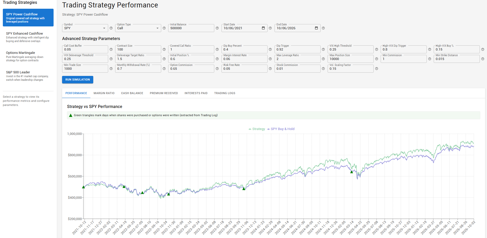

# TradingHub

TradingHub is a web-based platform for running trading strategy simulations, visualizing performance metrics, and analyzing trading results. It provides a simple interface for backtesting trading strategies across different time periods.



## Features

- **Strategy Simulation**: Backtest trading strategies over custom date ranges
- **Performance Visualization**: View account balance charts and key performance metrics
- **Strategy Configuration**: Customize strategy parameters like symbols, option types, and risk management settings
- **Database Storage**: Save simulation results for later review and comparison
- **API Access**: RESTful API for programmatic access to simulation capabilities

## Tech Stack

- **Backend**: Flask (Python)
- **Database**: PostgreSQL
- **Frontend**: React.js, Bootstrap, Chart.js
- **API**: RESTful JSON API

## Installation

### Prerequisites

- Python 3.8+
- PostgreSQL
- pip (Python package manager)
- Node.js and npm (for frontend)

### Setup Instructions

1. **Clone the repository**
   ```bash
   git clone https://github.com/yourusername/TradingHub.git
   cd TradingHub
   ```

2. **Install Python dependencies**
   ```bash
   make venv
   ```
   Alternatively, you can set up the virtual environment manually:
   ```bash
   python -m venv .venv
   # On Windows:
   .\.venv\Scripts\pip install -r requirements.txt
   # On Linux/Mac:
   ./.venv/bin/pip install -r requirements.txt
   ```

3. **Install frontend dependencies**
   ```bash
   cd frontend
   npm install
   cd ..
   ```

4. **Set up the database**
   ```bash
   # Create a PostgreSQL database
   createdb tradinghub
   ```

5. **Configure environment variables**
   ```bash
   # Create .env file in backend/services directory
   echo "DB_NAME=tradinghub" > backend/services/.env
   echo "DB_USER=postgres" >> backend/services/.env
   echo "DB_PASSWORD=your_password" >> backend/services/.env
   echo "DB_HOST=localhost" >> backend/services/.env
   echo "DB_PORT=5432" >> backend/services/.env
   ```

## Running the Application

### Starting the Backend Server

1. **Start the API server**
   ```bash
   # On Windows:
   .\.venv\Scripts\python backend\simple_app.py

   # On Linux/Mac:
   ./.venv/bin/python backend/simple_app.py
   ```

   The backend server will run on http://127.0.0.1:8080

### Starting the Frontend Server

2. **Start the React frontend**
   ```bash
   cd frontend
   npm start
   ```

   The frontend will be available at http://localhost:3000 or http://localhost:3001

### Accessing the Application

- **Frontend:** http://localhost:3000 (or http://localhost:3001)
- **API Endpoints:**
  - API Test: http://localhost:8080/api/test
  - Strategies List: http://localhost:8080/api/strategies
  - Simulation Endpoint: http://localhost:8080/api/simulate (POST)

## Troubleshooting

- **Dependency Issues:** If you encounter the scipy/numpy version mismatch error, try upgrading scipy to match your numpy version:
  ```bash
  ./.venv/Scripts/pip install scipy==1.15.2
  ```

- **'Config' object has no attribute 'SYMBOL' Error:** This error occurs when the strategy configuration does not have the required SYMBOL attribute. The backend code automatically applies the SYMBOL attribute from the frontend configuration, or falls back to 'SPY' as a default value if not provided.

- **Port Conflicts:** If port 8080 or 3000 is already in use, check running processes and terminate any conflicting services.

## Strategy Parameters

TradingHub provides extensive customization through advanced strategy parameters. Below is a comprehensive guide to all available parameters:

### Unit Conventions

Percentage inputs on the dashboard use familiar percentage values: enter `40` for 40%, `60` for 60%, or `1.5` for 1.5%. The frontend configuration and API keep these values as decimal fractions (`0.4`, `0.6`, and `0.015`, respectively). This applies to allocation percentages, interest rates, option-cost buffers, strike distance, IV thresholds, and slippage.

**Monthly Withdrawal Rate is an exception:** both the input and API use percentage points, so `1.0` means 1%, not 100%. Price thresholds and leverage remain ratios; normalized VIX thresholds remain index values divided by 100. These fields are not percentage inputs.

### Basic Configuration
- **Symbol** (default: 'SPY') - The trading symbol/ticker for the underlying asset
- **Option Type** (default: 'call') - Type of options to trade (call or put)
- **Initial Balance** (default: $200,000) - Starting cash amount for the simulation

### Position Management Parameters
- **Initial Position Percent** (default: 60%; API: 0.6) - Percentage of available cash to use for initial stock position
- **Dip Buy Percent** (default: 40%; API: 0.4) - Additional percentage of cash to deploy when buying dips
- **Dip Trigger** (default ratio: 0.92) - Price threshold as a fraction of the recent high: 92% of that price, or an 8% drop
- **High-VIX Dip Buy Percent** (default: 15%; API: 0.15) - Percentage of available cash to deploy during a high-VIX dip
- **High-VIX Dip Trigger** (default ratio: 0.80) - Price threshold during high VIX: 80% of the recent high, or a 20% drop
- **Max Position Size** (default: 10,000) - Maximum number of shares that can be held
- **Min Trade Size** (default: 1,000) - Minimum dollar amount for a trade to be executed

### Options Parameters
- **Call Cost Buffer** (default: 5%; API: 0.05) - Safety buffer added to call option cost calculations
- **Contract Size** (default: 100) - Number of shares per options contract (standard is 100)
- **Covered Call Ratio** (default: 100%; API: 1.0) - Percentage of the stock position used for covered calls
- **Min Strike Distance** (default: 1.5%; API: 0.015) - Minimum percentage distance between current price and option strike price
- **Decrease Index / DEC_INDEX** (default ratio: 0.6) - OPTIONS_MARTIN purchase threshold at 60% of the reference option price, or a 40% drop; enter the ratio, not the drop percentage

### Risk Management Parameters
- **Max Leverage Ratio** (default: 2.0 = 2:1) - Maximum leverage ratio (position_value/account_value)
  - 2.0 = 2:1 leverage = 50% margin requirement (Reg T compliant)
  - IBKR allows up to 4:1 leverage (25% margin) for liquid stocks like SPY
- **Margin Interest Rate** (default: 6%; API: 0.06) - Annual interest rate charged on borrowed funds
- **Risk Free Rate** (default: 5%; API: 0.05) - Annual risk-free interest rate for option pricing models

### Trading Costs
- **Stock Commission** (default: $0.01) - Commission per share for stock trades
- **Option Commission** (default: $0.65) - Commission per options contract
- **Min Commission** (default: $1.00) - Minimum commission charged per trade
- **Slippage Percent** (SPY500_LEADER default: 0.1%; API: 0.001) - Simulated execution-price slippage

### Cash Management
- **Monthly Withdrawal Rate** (default: 1.0%) - Monthly cash withdrawal percentage; the input and API both use `1.0` for 1%, or `0` for no withdrawals

### Volatility Parameters
- **Volatility Scaling Factor** (default multiplier: 0.15) - Factor used to scale VIX-derived volatility for option pricing; this is a multiplier, not a 15% volatility input
- **VIX High / Deleverage Thresholds** (default normalized value: 0.25) - Each represents a VIX index level of 25, not an input of 0.25%
- **IV Entry Threshold** (OPTIONS_MARTIN default: 30%; API: 0.30) - Maximum implied volatility for entry when the IV filter is enabled
- **IV Exit Threshold** (OPTIONS_MARTIN default: 50%; API: 0.50) - Implied volatility level that triggers an exit when enabled

## Project Structure
